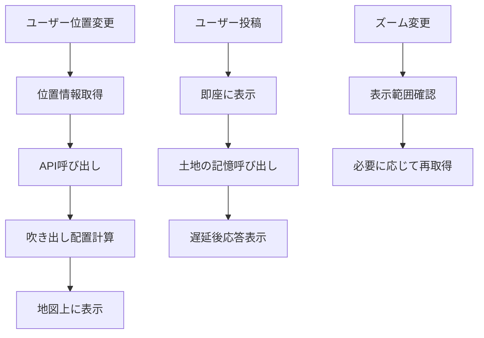

# 設計書

## 概要

Kodama空間SNSは、Flutter/Dartで構築されるクロスプラットフォーム（iOS/Android）モバイルアプリケーションです。地理的位置に基づく会話システムを実装し、ユーザーの投稿を地図上の吹き出しとして可視化します。AI「土地の記憶」システムが各地域の会話履歴から学習し、文脈的な応答を提供します。

## アーキテクチャ

### 全体アーキテクチャ

```
┌─────────────────┐    ┌─────────────────┐    ┌─────────────────┐
│   Flutter UI    │    │  State Management│    │   Data Layer    │
│                 │◄──►│   (Riverpod)     │◄──►│                 │
│ - Map View      │    │                 │    │ - Supabase      │
│ - Bubble UI     │    │ - Location State│    │ - API Service   │
│ - Post Sheet    │    │ - Bubble State  │    │ - Cache         │
└─────────────────┘    └─────────────────┘    └─────────────────┘
         │                       │                       │
         ▼                       ▼                       ▼
┌─────────────────┐    ┌─────────────────┐    ┌─────────────────┐
│   Platform      │    │   Business      │    │   External      │
│   Services      │    │   Logic         │    │   Services      │
│                 │    │                 │    │                 │
│ - Geolocator    │    │ - Bubble Layout │    │ - StadiaMaps    │
│ - Permissions   │    │ - Friendship    │    │ - Land Memory   │
└─────────────────┘    └─────────────────┘    └─────────────────┘
```

### レイヤー構成

1. **プレゼンテーション層**: Flutter UI コンポーネント
2. **状態管理層**: Riverpod による状態管理
3. **ビジネスロジック層**: ドメイン固有のロジック
4. **データ層**: Supabase、キャッシュ、API連携
5. **プラットフォーム層**: ネイティブサービスとの連携

## 依存関係（pubspec.yaml）

```yaml
dependencies:
  flutter:
    sdk: flutter
  flutter_map: ^5.0.0
  latlong2: ^0.9.0
  url_launcher: ^6.1.6
  flutter_riverpod: ^2.4.9
  supabase_flutter: ^2.3.4
  geolocator: ^10.1.0
  permission_handler: ^11.1.0
  flutter_dotenv: ^5.1.0
```

## コンポーネントとインターフェース

### 主要コンポーネント

#### 1. MapViewController
```dart
class MapViewController {
  // 地図の表示とズーム制御
  void initializeMap();
  void updateLocation(LatLng location);
  void handleZoomChange(double zoom);
}
```

#### 2. BubbleManager
```dart
class BubbleManager {
  // 吹き出しの配置と表示管理
  List<BubblePosition> layoutBubbles(List<Post> posts, Bounds viewBounds);
  void preventOverlap(List<BubblePosition> positions, double minDistance);
  void animateBubbleAppearance(Post post);
  BubbleDisplayKind determineDisplayKind(Post post, String currentUserId);
}
```

#### 3. LandMemoryService
```dart
class LandMemoryService {
  // 土地の記憶システム（MVP時はモック）
  Future<Post> generateResponse(double lat, double lng, String userText, List<Post> context);
  void addRandomDelay(); // 0.5-2.0秒のランダム遅延
}
```

#### 4. ApiService
```dart
class ApiService {
  // バックエンドAPI連携
  Future<PostListResponse> getPosts(double lat, double lng);
  Future<CreatePostResponse> createPost(CreatePostRequest request);
  Future<void> handleNetworkError(Exception error);
}
```

#### 5. FriendshipManager
```dart
class FriendshipManager {
  // 友達関係の管理
  void trackCoLocation(String userId, double lat, double lng, DateTime timestamp);
  bool areFriends(String userId1, String userId2);
  void cleanupExpiredFriendships(); // 24時間後にクリーンアップ
}
```

### データフロー



## 地図実装（StadiaMaps）

### APIキーの扱い

#### 方法1: .envファイルを使用（推奨）

環境変数を.envファイルで管理し、flutter_dotenvで読み込む方法：

**1. .envファイルの作成**
```bash
# frontend/.env
STADIA_API_KEY=あなたのAPIキー
```

**2. .gitignoreに追加**
```bash
# frontend/.gitignore
.env
```

**3. pubspec.yamlに.envを含める**
```yaml
flutter:
  assets:
    - .env
```

**4. main.dartで読み込み**
```dart
import 'package:flutter/material.dart';
import 'package:flutter_dotenv/flutter_dotenv.dart';
import 'app/app.dart';

Future<void> main() async {
  WidgetsFlutterBinding.ensureInitialized();
  await dotenv.load(fileName: ".env");
  runApp(const KodamaMapApp());
}
```

**5. APIキーの使用**
```dart
import 'package:flutter_dotenv/flutter_dotenv.dart';

// 地図コンポーネント内で使用
final _apiKey = dotenv.env['STADIA_API_KEY'] ?? '';
```

#### 方法2: dart-defineを使用

コマンドライン引数で環境変数を渡す方法：

```bash
# 実行例（開発時）
flutter run --dart-define=STADIA_API_KEY=あなたのキー

# iOS実機/シミュレータ
flutter run -d ios --dart-define=STADIA_API_KEY=あなたのキー
```

### 地図コンポーネント実装

```dart
// lib/features/map/presentation/map_screen.dart
import 'package:flutter/material.dart';
import 'package:flutter_map/flutter_map.dart';
import 'package:latlong2/latlong.dart';
import 'package:flutter_dotenv/flutter_dotenv.dart';

const _styleUrl = "https://tiles.stadiamaps.com/tiles/alidade_smooth_dark/{z}/{x}/{y}{r}.png";

class MapScreen extends StatelessWidget {
  const MapScreen({super.key});

  @override
  Widget build(BuildContext context) {
    final apiKey = dotenv.env['STADIA_API_KEY'] ?? '';
    
    return Scaffold(
      body: FlutterMap(
        options: const MapOptions(
          center: LatLng(35.4658, 139.6201), // 横浜駅
          zoom: 15,
          keepAlive: true,
          maxZoom: 18,
          minZoom: 10,
        ),
        children: [
          TileLayer(
            urlTemplate: "$_styleUrl?api_key={api_key}",
            additionalOptions: {"api_key": apiKey},
            maxZoom: 20,
            maxNativeZoom: 20,
          ),
          // 吹き出しレイヤー（今後実装）
        ],
      ),
    );
  }
}
```

## バックエンドAPI仕様

### API エンドポイント

#### GET /posts - ポストの閲覧
```
GET /posts?lat={latitude}&lng={longitude}
```
- **Request Parameters**: 
  - `lat`: 緯度（double）
  - `lng`: 経度（double）
- **Response**: `PostListResponse`
  ```dart
  class PostListResponse {
    final List<Post> posts;        // 現在位置周辺の投稿一覧
    final int totalCount;          // 総投稿数
  }
  ```
- **処理フロー**:
  1. バックエンドで座標からgeohashを計算
  2. 適切な精度レベルを判定
  3. 周辺の投稿を取得して返却

#### POST /posts - ユーザーポストの作成
```
POST /posts
```
- **Request Body**: `CreatePostRequest`
  ```dart
  class CreatePostRequest {
    final double lat;              // 投稿位置の緯度
    final double lng;              // 投稿位置の経度
    final String text;             // 投稿本文（最大280文字）
    final String userId;           // 匿名ハンドル
  }
  ```
- **Response**: `CreatePostResponse`
  ```dart
  class CreatePostResponse {
    final Post userPost;           // 作成されたユーザー投稿
    final Post landReply;          // LLMによる土地の記憶応答
    final List<Post> relatedPosts; // 関連投稿
  }
  ```
- **処理フロー**:
  1. バックエンドで座標からgeohashを計算
  2. ユーザー投稿をDBに保存
  3. LLMに座標・本文・過去の文脈を送信して応答生成
  4. 土地の記憶応答をDBに保存
  5. 関連投稿を取得
  6. 全てをレスポンスとして返却
- **応答時間**: 0.5-2.0秒（LLM処理時間含む）

## データモデル

### 核となるデータ構造

```dart
// 投稿データモデル
class Post {
  final String id;           // UUID
  final double lat;          // 表示用座標
  final double lng;          // 表示用座標
  final PostKind kind;       // 'user' | 'land'
  final String text;         // 本文
  final DateTime createdAt;  // 作成時刻
  final String? userId;      // 匿名ハンドル（userのみ）
}

enum PostKind { user, land }

// API リクエスト/レスポンスモデル
class CreatePostRequest {
  final double lat;          // 投稿位置の緯度
  final double lng;          // 投稿位置の経度
  final String text;         // 投稿本文（最大280文字）
  final String userId;       // 匿名ハンドル
}

class CreatePostResponse {
  final Post userPost;       // 作成されたユーザー投稿
  final Post landReply;      // LLMによる土地の記憶応答
  final List<Post> relatedPosts; // 関連投稿
}

class PostListResponse {
  final List<Post> posts;    // ユーザー投稿一覧
  final int totalCount;      // 総投稿数
}

// UI表示用の吹き出し配置情報
class BubblePosition {
  final Post post;
  final LatLng position;     // 地図上の表示位置
  final bool isVisible;      // 画面内表示フラグ
  final BubbleDisplayKind displayKind; // 表示区分
}

enum BubbleDisplayKind { me, friend, land, all }

// 友達関係データ
class Friendship {
  final String userId1;
  final String userId2;
  final double lat;          // 出会った場所の緯度
  final double lng;          // 出会った場所の経度
  final DateTime createdAt;  // 関係開始時刻
  final DateTime expiresAt;  // 24時間後の期限
}
```

### Supabaseスキーマ設計

```sql
-- 投稿テーブル
CREATE TABLE posts (
  id UUID PRIMARY KEY DEFAULT gen_random_uuid(),
  geohash TEXT NOT NULL,          -- バックエンドで計算されたgeohash
  lat DOUBLE PRECISION NOT NULL,  -- 表示座標
  lng DOUBLE PRECISION NOT NULL,  -- 表示座標
  kind TEXT NOT NULL CHECK (kind IN ('user', 'land')), -- 投稿種別
  text TEXT NOT NULL,
  user_id TEXT,                   -- 匿名ハンドル（userのみ）
  created_at TIMESTAMP WITH TIME ZONE DEFAULT NOW()
);

-- インデックス
CREATE INDEX idx_posts_geohash ON posts(geohash);
CREATE INDEX idx_posts_created_at ON posts(created_at DESC);
CREATE INDEX idx_posts_kind ON posts(kind);

-- 空間インデックス（PostGIS使用時）
CREATE EXTENSION IF NOT EXISTS postgis;
ALTER TABLE posts ADD COLUMN location GEOGRAPHY(POINT);
UPDATE posts SET location = ST_MakePoint(lng, lat);
CREATE INDEX idx_posts_location ON posts USING GIST(location);
```

## エラーハンドリング

### エラー分類と対応

#### 1. ネットワークエラー
```dart
class NetworkErrorHandler {
  Future<T> withRetry<T>(Future<T> Function() operation) async {
    int attempts = 0;
    while (attempts < 3) {
      try {
        return await operation();
      } catch (e) {
        attempts++;
        if (attempts >= 3) rethrow;
        await Future.delayed(Duration(seconds: pow(2, attempts).toInt()));
      }
    }
  }
}
```

#### 2. 位置情報エラー
```dart
class LocationErrorHandler {
  Future<LatLng> getCurrentLocationWithFallback() async {
    try {
      final position = await Geolocator.getCurrentPosition();
      return LatLng(position.latitude, position.longitude);
    } catch (e) {
      // 横浜駅をデフォルト位置として使用
      return const LatLng(35.4658, 139.6201);
    }
  }
}
```

#### 3. データ整合性エラー
```dart
class DataValidationService {
  bool isValidPost(Post post) {
    return post.text.isNotEmpty && 
           post.text.length <= 280;
  }
  
  Post sanitizePost(Post post) {
    return post.copyWith(
      text: post.text.trim().substring(0, min(280, post.text.length))
    );
  }
}
```

### エラー表示戦略

1. **スナックバー**: 一時的なエラー（ネットワーク、投稿失敗）
2. **ダイアログ**: 重要なエラー（権限拒否、データ破損）
3. **インライン表示**: フォーム検証エラー
4. **サイレント処理**: 軽微なエラー（キャッシュ失敗など）

## テスト戦略

### テストピラミッド

```
        ┌─────────────┐
        │   E2E Tests │  ← 少数の重要フロー
        │    (5%)     │
        └─────────────┘
      ┌─────────────────┐
      │ Integration Tests│  ← コンポーネント間連携
      │     (25%)       │
      └─────────────────┘
    ┌───────────────────────┐
    │    Unit Tests         │  ← ビジネスロジック中心
    │      (70%)            │
    └───────────────────────┘
```

### テスト対象の優先順位

#### 高優先度（必須）
1. **BubbleManager**: 吹き出し配置ロジック
2. **FriendshipManager**: 友達関係の判定
3. **データモデル**: バリデーションロジック
4. **ApiService**: API通信とエラーハンドリング

#### 中優先度（推奨）
1. **MapViewController**: 地図操作の統合テスト
2. **LandMemoryService**: モック応答の動作
3. **LocationService**: 位置情報取得と権限処理

#### 低優先度（オプション）
1. **UI Widget**: 表示コンポーネント
2. **アニメーション**: 視覚効果
3. **パフォーマンス**: レスポンス時間測定

### モックとテストダブル

```dart
// テスト用のモックサービス
class MockApiService implements ApiService {
  @override
  Future<PostListResponse> getPosts(double lat, double lng) async {
    await Future.delayed(Duration(milliseconds: 300));
    return PostListResponse(
      posts: _generateMockPosts(lat, lng, 10),
      totalCount: 10,
    );
  }

  @override
  Future<CreatePostResponse> createPost(CreatePostRequest request) async {
    await Future.delayed(Duration(milliseconds: 800)); // LLM処理時間をシミュレート
    
    final userPost = Post(
      id: 'user-${DateTime.now().millisecondsSinceEpoch}',
      lat: request.lat,
      lng: request.lng,
      kind: PostKind.user,
      text: request.text,
      createdAt: DateTime.now(),
      userId: request.userId,
    );
    
    final landReply = Post(
      id: 'land-${DateTime.now().millisecondsSinceEpoch}',
      lat: request.lat + 0.0001, // 少しずらした位置
      lng: request.lng + 0.0001,
      kind: PostKind.land,
      text: 'この場所の記憶: ${request.text} への応答',
      createdAt: DateTime.now(),
      userId: null,
    );
    
    return CreatePostResponse(
      userPost: userPost,
      landReply: landReply,
      relatedPosts: _generateMockPosts(request.lat, request.lng, 3),
    );
  }
}
```

## パフォーマンス最適化

### 地図レンダリング最適化

1. **タイルキャッシュ**: flutter_map の内蔵キャッシュ活用
2. **吹き出し制限**: 画面あたり最大30個
3. **ビューポート外除外**: 表示範囲外の吹き出しは非表示
4. **アニメーション最適化**: 60fps維持のための軽量アニメーション

### メモリ管理

```dart
class PostCache {
  final Map<String, PostListResponse> _cache = {};
  final int maxCacheSize = 50; // キャッシュサイズ上限
  
  void addToCache(String key, PostListResponse response) {
    if (_cache.length >= maxCacheSize) {
      // LRU方式で古いキャッシュを削除
      final oldestKey = _cache.keys.first;
      _cache.remove(oldestKey);
    }
    _cache[key] = response;
  }
  
  PostListResponse? getFromCache(double lat, double lng) {
    final key = '${lat}_${lng}';
    return _cache[key];
  }
  
  void invalidateCache() {
    _cache.clear();
  }
}
```

### ネットワーク最適化

1. **リクエスト統合**: 同一位置の重複リクエスト防止
2. **スロットリング**: 移動時の400ms遅延
3. **キャッシュ戦略**: 最近の位置情報をメモリキャッシュ
4. **圧縮**: gzip圧縮によるデータ転送量削減

## セキュリティとプライバシー

### プライバシー保護

1. **匿名化**: 個人識別情報の非保存
2. **日次ローテーション**: ユーザーハンドルの定期変更
3. **位置情報最小化**: 必要最小限の精度での位置取得
4. **データ保持期間**: 会話データの自動削除（将来実装）

### セキュリティ対策

```dart
class SecurityService {
  // 匿名ハンドル生成（日次ローテーション）
  String generateDailyHandle() {
    final deviceId = getDeviceId(); // 端末固有ID
    final date = DateTime.now().toIso8601String().substring(0, 10);
    final hash = sha256.convert(utf8.encode('$deviceId-$date')).toString();
    return hash.substring(0, 8); // 8文字のハンドル
  }
  
  // 投稿内容のサニタイズ
  String sanitizeText(String input) {
    return input
        .replaceAll(RegExp(r'<[^>]*>'), '') // HTMLタグ除去
        .replaceAll(RegExp(r'[^\w\s\u3040-\u309F\u30A0-\u30FF\u4E00-\u9FAF]'), '') // 特殊文字除去
        .trim();
  }
}
```

## 国際化とアクセシビリティ

### アクセシビリティ対応

1. **セマンティクス**: 適切なセマンティクスラベル
2. **フォントスケーリング**: システムフォントサイズ対応
3. **ヒットターゲット**: 最小44dpのタッチ領域
4. **コントラスト**: WCAG準拠の色彩設計

### 多言語対応（将来実装）

```dart
// 国際化対応の準備
class AppLocalizations {
  static const supportedLocales = [
    Locale('ja', 'JP'), // 日本語（メイン）
    Locale('en', 'US'), // 英語（将来）
  ];
}
```

## 監視とログ

### パフォーマンス監視

```dart
class PerformanceMonitor {
  void trackMapRenderTime() {
    final stopwatch = Stopwatch()..start();
    // 地図レンダリング処理
    stopwatch.stop();
    if (stopwatch.elapsedMilliseconds > 3000) {
      logSlowRender(stopwatch.elapsedMilliseconds);
    }
  }
  
  void trackPostLayoutTime(int postCount) {
    final stopwatch = Stopwatch()..start();
    // 投稿配置処理
    stopwatch.stop();
    logLayoutPerformance(postCount, stopwatch.elapsedMilliseconds);
  }
  
  void trackApiResponseTime(String endpoint, int responseTimeMs) {
    if (responseTimeMs > 3000) {
      logSlowApiResponse(endpoint, responseTimeMs);
    }
  }
}
```

### エラーログ

1. **クラッシュレポート**: Firebase Crashlytics（将来実装）
2. **パフォーマンスログ**: 地図操作、API応答時間
3. **ユーザー行動ログ**: 投稿頻度、ズーム操作パターン
4. **エラー分類**: ネットワーク、位置情報、データ整合性

## プロジェクト構成

```
lib/
├── main.dart                      # エントリーポイント
├── app/
│   └── app.dart                   # アプリケーション本体
├── core/
│   ├── constants/                 # 定数定義
│   ├── errors/                    # エラー定義
│   └── utils/                     # ユーティリティ
└── features/
    ├── map/
    │   ├── presentation/          # UI層
    │   │   └── map_screen.dart
    │   ├── widgets/               # UIコンポーネント
    │   │   ├── map_attribution.dart
    │   │   └── bubble_widget.dart
    │   └── services/              # マップサービス
    ├── post/
    │   ├── models/                # データモデル
    │   ├── services/              # API連携
    │   └── widgets/               # 投稿関連UI
    └── auth/
        └── services/              # 認証・匿名ID管理
```

## 開発者ツール（デバッグ機能）

### 概要

開発効率向上のため、`.env`ファイルで制御可能な開発者専用ツールを提供します。本番環境では完全に無効化され、パフォーマンスやセキュリティに影響しません。

### 環境変数制御

#### .env設定
```bash
# 開発環境
DEV_TOOLS=true

# 本番環境
DEV_TOOLS=false
```

#### main.dartでの環境変数読み込み
```dart
Future<void> main() async {
  WidgetsFlutterBinding.ensureInitialized();
  await dotenv.load(fileName: ".env");
  runApp(const KodamaMapApp());
}
```

### ジョイスティックコントロール

#### DevJoystickウィジェット仕様
```dart
class DevJoystick extends StatefulWidget {
  final Function(Offset offset) onChanged;
  final double size;
  final Color backgroundColor;
  final Color knobColor;
  
  const DevJoystick({
    super.key,
    required this.onChanged,
    this.size = 100,
    this.backgroundColor = const Color(0x88000000),
    this.knobColor = Colors.white,
  });
}
```

#### 機能仕様
1. **表示制御**: `DEV_TOOLS=true`時のみ表示
2. **操作範囲**: 円形領域内でのドラッグ操作
3. **座標変換**: ジョイスティック入力を地図座標オフセットに変換
4. **センタリング**: 操作終了時に中央に戻る
5. **視覚フィードバック**: 操作中のノブ位置表示

#### 地図連携
```dart
// MapScreen内での使用例
if (dotenv.env['DEV_TOOLS']?.toLowerCase() == 'true')
  Positioned(
    left: 16,
    bottom: 24,
    child: DevJoystick(
      onChanged: (offset) {
        final center = _mapController.camera.center;
        final newCenter = LatLng(
          center.latitude - offset.dy * 0.0003,
          center.longitude + offset.dx * 0.0003,
        );
        _mapController.move(newCenter, _mapController.camera.zoom);
      },
    ),
  ),
```

### 仮想位置システム

#### DevLocationService
```dart
class DevLocationService {
  static LatLng? _virtualLocation;
  static bool get isDevMode => dotenv.env['DEV_TOOLS']?.toLowerCase() == 'true';
  
  // 仮想位置の設定
  static void setVirtualLocation(LatLng location) {
    if (isDevMode) {
      _virtualLocation = location;
    }
  }
  
  // 位置取得（開発モード時は仮想位置を返す）
  static Future<LatLng> getCurrentLocation() async {
    if (isDevMode && _virtualLocation != null) {
      return _virtualLocation!;
    }
    // 通常の位置取得処理
    return LocationService().getCurrentLocation();
  }
}
```

### セキュリティ考慮事項

#### ビルド時の除外
```dart
// 本番ビルド用の条件分岐
Widget build(BuildContext context) {
  final devMode = kDebugMode && 
    dotenv.env['DEV_TOOLS']?.toLowerCase() == 'true';
  
  return Scaffold(
    body: Stack(
      children: [
        // 地図表示
        _buildMap(),
        // 開発ツール（デバッグモードかつDEV_TOOLS=trueの場合のみ）
        if (devMode) _buildDevTools(),
      ],
    ),
  );
}
```

#### .gitignore設定
```bash
# 本番用環境ファイルは除外
.env.production
.env.staging
```

### パフォーマンス最適化

1. **遅延初期化**: 開発ツールの初期化は必要時のみ
2. **条件分岐**: リリースビルドでは完全に除外
3. **メモリ効率**: 開発ツール無効時はインスタンス生成なし

### 拡張可能性

将来的な開発ツール機能拡張のための設計：

```dart
class DevToolsPanel extends StatelessWidget {
  @override
  Widget build(BuildContext context) {
    return Container(
      padding: EdgeInsets.all(16),
      decoration: BoxDecoration(
        color: Colors.black87,
        borderRadius: BorderRadius.circular(8),
      ),
      child: Column(
        mainAxisSize: MainAxisSize.min,
        children: [
          // ジョイスティック
          DevJoystick(onChanged: _onLocationChange),
          SizedBox(height: 16),
          // 将来の機能拡張エリア
          // - ズームレベル制御
          // - 投稿データモック
          // - API応答シミュレーション
        ],
      ),
    );
  }
}
```

### ディレクトリ構造更新
```
lib/
├── features/
│   ├── map/
│   │   ├── widgets/
│   │   │   ├── map_attribution.dart
│   │   │   ├── bubble_widget.dart
│   │   │   └── dev_tools/          # 開発ツール専用
│   │   │       ├── dev_joystick.dart
│   │   │       ├── dev_tools_panel.dart
│   │   │       └── dev_location_service.dart
```

この設計により、開発効率の向上と本番環境での安全性を両立した開発者ツールシステムを実現します。

---

この設計書は、要件定義で定義された全ての機能要件を技術的に実現するための詳細な設計を提供しています。Flutter/DartエコシステムとStadiaMapsを活用し、スケーラブルで保守性の高いアーキテクチャを採用しています。